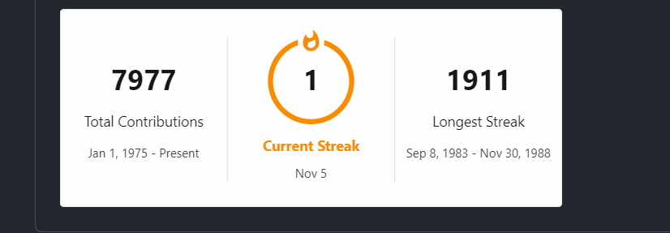

# Git commit logger

This tool creates git commit for your profile for a year.

### Example 1



### Example 2


### Example 3


---

## Steps to run 

- Go to any local repository.
- Run ```npx commit_git```